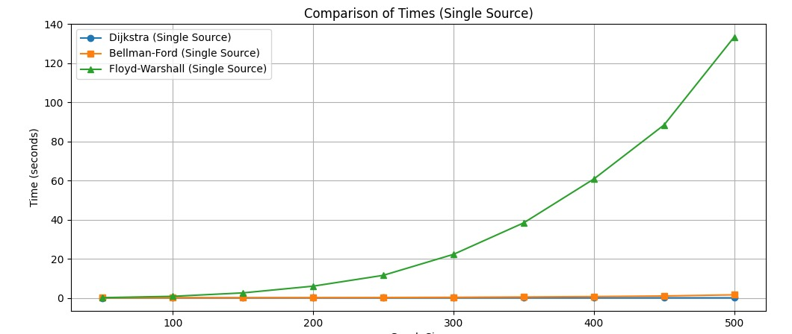

# Shortest Path Algorithms in Graphs

## Introduction

Finding the shortest path in a graph is a crucial problem in computer science and is used in a variety of applications such as routing, network analysis, and operations research. This document explores three well-known algorithms for solving the single-source and all-pairs shortest path problems: **Dijkstra's algorithm**, **Bellman-Ford algorithm**, and **Floyd-Warshall algorithm**.

---

## 1. Dijkstra's Algorithm

### Description

Dijkstra’s algorithm computes the shortest path from a starting node to all other nodes in a graph with non-negative edge weights. It uses a **min-priority queue** (heap) to efficiently select the node with the smallest tentative distance.

### Algorithm Steps

1. Initialize distances to all nodes as infinity, except for the starting node (0).
2. Use a priority queue to track nodes to visit, prioritized by their current shortest distance.
3. Pop the node with the smallest distance.
4. For each neighbor, calculate the distance through the current node.
5. If the new distance is smaller, update it and push it to the queue.
6. Repeat until all nodes have been visited.

---

## 2. Bellman-Ford Algorithm

### Description

Bellman-Ford computes the shortest paths from a single source, handling **negative edge weights**, and also detects **negative weight cycles**.

### Algorithm Steps

1. Initialize distances to all nodes as infinity, except for the starting node (0).
2. Repeat |V| - 1 times:
   - For each edge, update the distance if a shorter path is found.
3. Perform one more iteration to check for negative weight cycles.
4. If a shorter path is found in this step, report a negative cycle.

---

## 3. Floyd-Warshall Algorithm

### Description

Floyd-Warshall computes the shortest paths between **all pairs of nodes**. It uses **dynamic programming** and handles negative weights (but not negative cycles).

### Algorithm Steps

1. Initialize the distance between all pairs: 0 for self-loops, edge weights for direct connections, infinity otherwise.
2. For each intermediate node `k`, update the path from `i` to `j` as:
   - `dist[i][j] = min(dist[i][j], dist[i][k] + dist[k][j])`
3. Repeat for all combinations of nodes.

---

## Complexities

| Algorithm         | Time Complexity | Space Complexity | Handles Negative Weights | Detects Negative Cycles |
|------------------|------------------|-------------------|---------------------------|--------------------------|
| Dijkstra          | O((V + E) log V) | O(V)              | No                        | No                       |
| Bellman-Ford      | O(V * E)         | O(V)              | Yes                       | Yes                      |
| Floyd-Warshall    | O(V³)            | O(V²)             | Yes                       | No                       |

---
## Coverage

Make sure you have "coverage" in your requirements.txt file and run pip install. Then run `python -m coverage run -m unittest discover` and after that run `python -m coverage report` to get the following table:
```
Name                          Stmts   Miss  Cover
-------------------------------------------------
data\data_generator.py           52      1    98%
shortest_path\algorithms.py      48      1    98%
test\__init__.py                  0      0   100%
test\test_algorithms.py          28      1    96%
test\test_data_generator.py      38      0   100%
-------------------------------------------------
TOTAL                           166      3    98%

```

If you want to see the lines that are not being used you can run 'python -m cover html' and then 'start htmlcov\index.html'
---
## Notes

- **Dijkstra** is optimal for sparse graphs with non-negative weights.
- **Bellman-Ford** is essential when negative weights are present and cycles need to be detected.
- **Floyd-Warshall** is best for dense graphs where all-pairs shortest paths are needed.

Choose the right algorithm based on the graph structure and the specific problem constraints.
## Experiments


